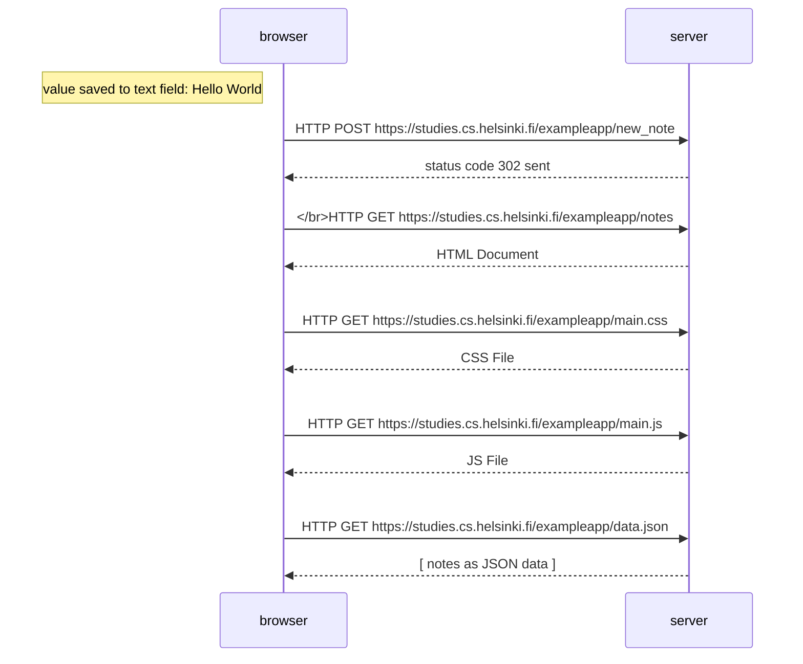

```mermaid
  sequenceDiagram
    participant browser
    participant server
    note left of browser: value saved to text field: Hello World
    browser->>server: HTTP POST https://studies.cs.helsinki.fi/exampleapp/new_note
    server-->>browser: status code 302 sent
    browser->>server: <br/></br>HTTP GET https://studies.cs.helsinki.fi/exampleapp/notes
    server-->>browser: HTML Document
    browser->>server: <br/><br/>HTTP GET https://studies.cs.helsinki.fi/exampleapp/main.css
    server-->>browser: CSS File
    browser->>server: <br/><br/>HTTP GET https://studies.cs.helsinki.fi/exampleapp/main.js
    server-->>browser: JS File
    browser->>server: <br/><br/>HTTP GET https://studies.cs.helsinki.fi/exampleapp/data.json
    server-->>browser: [ notes as JSON data ]
```
