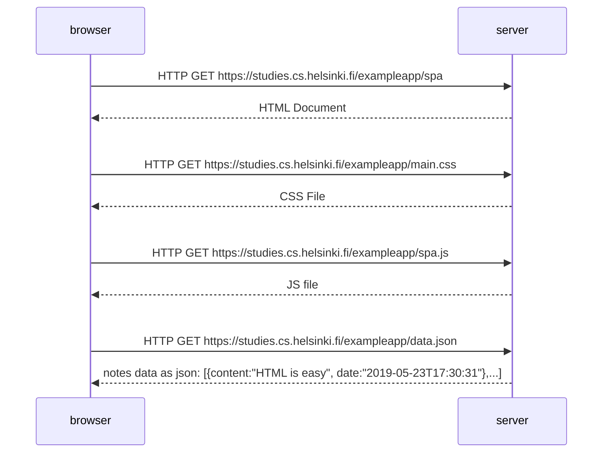

```mermaid
sequenceDiagram
    participant browser
    participant server
    browser->>server: HTTP GET https://studies.cs.helsinki.fi/exampleapp/spa
    server-->>browser: HTML Document
    browser->>server: <br/><br/>HTTP GET https://studies.cs.helsinki.fi/exampleapp/main.css
    server-->>browser: CSS File
    browser->>server: <br/><br/>HTTP GET https://studies.cs.helsinki.fi/exampleapp/spa.js
    server-->>browser: JS file
    browser->>server: <br/><br/>HTTP GET https://studies.cs.helsinki.fi/exampleapp/data.json
    server-->>browser: notes data as json: [{content:"HTML is easy", date:"2019-05-23T17:30:31"},...]
```
