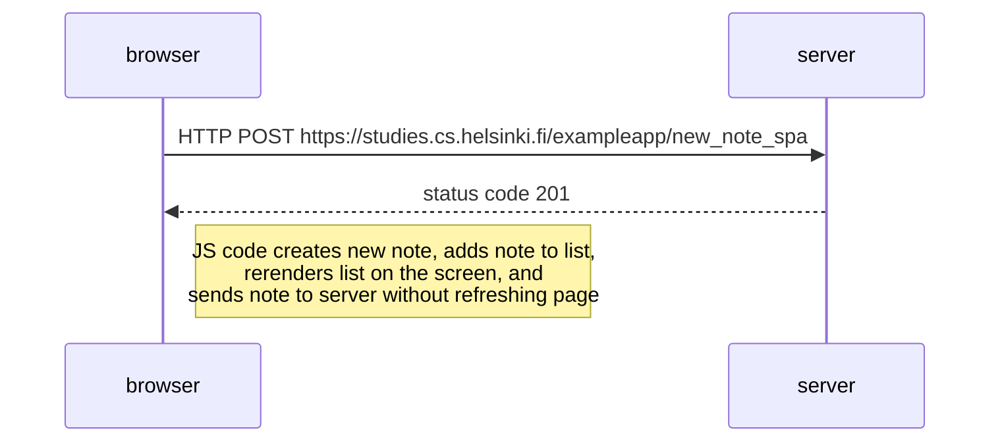

```mermaid
sequenceDiagram
    participant browser
    participant server
    browser->>server: HTTP POST https://studies.cs.helsinki.fi/exampleapp/new_note_spa
    server-->>browser: status code 201
    note right of browser: JS code creates new note, adds note to list, <br/>rerenders list on the screen, and <br/>sends note to server without refreshing page 
```
